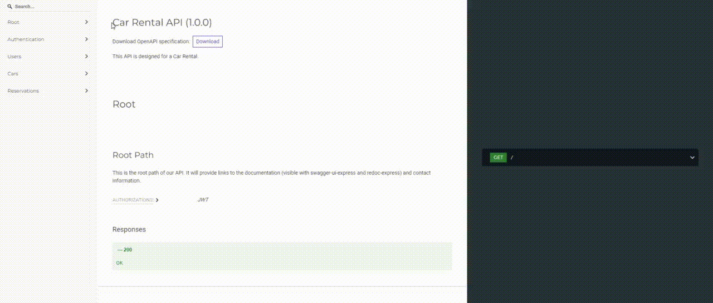

# Car Rental API

Welcome to the Car Rental API, where users can create accounts and make reservations. Admins have the authority to perform CRUD operations on users, cars, and reservations. This API is developed using Node.js, Express.js, Mongoose, and MongoDB. The application is hosted locally.

## Outcome 

Link: https://carrent-3dr6.onrender.com/

